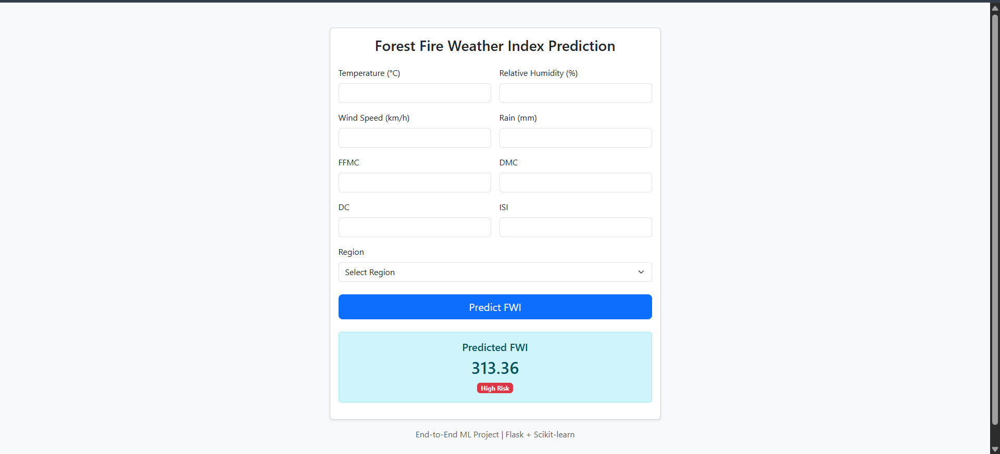

# 🔥 Algerian Forest Fire Predictor (FWI Prediction)


## 📌 Project Overview
This project is a machine learning web application designed to predict the **Fire Weather Index (FWI)** based on meteorological data collected from the Algerian forest regions.

The application utilizes a **Ridge Regression** model trained on the *Algerian Forest Fires Dataset*. It provides a user-friendly interface built with **Flask**, allowing users to input environmental parameters (such as temperature, humidity, and wind speed) to estimate the potential fire danger intensity.

---

## 📸 Sample Result


*Above: A preview of the web interface where users input weather data to receive an FWI prediction.*

---

## 📂 About the Dataset
The model is trained on the **Algerian Forest Fires Dataset**, which includes data from two regions in Algeria: the **Bejaia** region and the **Sidi Bel-Abbes** region.

Dataset link: https://www.kaggle.com/datasets/nitinchoudhary012/algerian-forest-fires-dataset

### Features Used for Prediction
The model requires **9 input features** to generate a prediction, as defined in the training pipeline:

| Feature | Description |
| :--- | :--- |
| **Temperature** | Maximum temperature in noon (°C) |
| **RH** | Relative Humidity in % |
| **Ws** | Wind Speed in km/h |
| **Rain** | Total day rain in mm |
| **FFMC** | Fine Fuel Moisture Code (indicates ignition potential) |
| **DMC** | Duff Moisture Code (indicates fuel consumption in moderate soil layers) |
| **DC** | Drought Code (indicates fuel consumption in deep soil layers) |
| **ISI** | Initial Spread Index (velocity of fire spread) |
| **Region** | Binary Class (0 for Bejaia, 1 for Sidi Bel-Abbes) |

### Target Variable
* **FWI (Fire Weather Index):** A numerical rating of fire intensity. [cite_start]The dataset also contains a `Classes` column (fire/not fire), but this specific app predicts the continuous `FWI` value using Regression[cite: 2].

---

## 🛠️ Technical Architecture

### Tech Stack
* **Frontend:** HTML/CSS (rendered via Flask templates)
* **Backend:** Python, Flask
* **Machine Learning:** Scikit-Learn (Ridge Regression), NumPy, Pandas
  

### Project Structure
```bash
├── model/
│   ├── ridge.pkl        # Trained Ridge Regression Model
│   └── scaler.pkl       # Standard Scaler for feature normalization
├── templates/
│   └── index.html       # Frontend UI for the form
├── Algerian_forest_fires_cleaned_dataset.csv  # Source data
├── app.py               # Main Flask application
├── requirements.txt     # Python dependencies
└── README.md            # Project documentation

```
---
🚀 Installation & Usage
Follow these steps to run the application locally.

1. Clone the Repository
```
git clone [https://github.com/your-username/algerian-forest-fire-predictor.git](https://github.com/your-username/algerian-forest-fire-predictor.git)
cd algerian-forest-fire-predictor
```
2. Create a Virtual Environment (Optional but Recommended)
```
# For Windows
python -m venv venv
venv\Scripts\activate

# For Mac/Linux
python3 -m venv venv
source venv/bin/activate
```
3. Install Dependencies
Install the required libraries listed in requirements.txt:
```
pip install -r requirements.txt
```
4. Run the Application
Start the Flask server:
```
python app.py
```
5. Access the App
Open your browser and navigate to:
```
 http://127.0.0.1:5000/
```

## 🧠 Model Performance
The model uses **Ridge Regression** to handle multicollinearity between the fire weather indices (FFMC, DMC, DC, ISI).

**Preprocessing:** Features are standardized using a `StandardScaler` before being fed into the model
**Input Validation:** The app includes error handling to ensure exactly **9 features** are provided before attempting a prediction

---

## 🤝 Contributing
Contributions are welcome! Please fork the repository and create a pull request for any feature updates or bug fixes.
Contributions are welcome! Please fork the repository and create a pull request for any feature updates or bug fixes.

